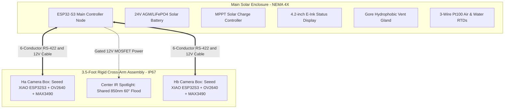

# Brady Ditch flow monitor

## Project Overview

The Brady Ditch Flume Monitor is an intended solar-powered water recorder for a Parshall flume. The field design uses an ESP32-S3 controller and two outdoor cameras to read staff gauges without touching the water.

> **Current firmware status — proof of concept:** the checked-in firmware builds an ESP-IDF application that runs a fixed 169-frame vision benchmark, attempts to write one annotated BMP to a pre-provisioned SPIFFS partition, emits a demo head value, and rejects flow conversion until certified calibration is supplied. Camera capture, dual-node RS-422 communication, SD/CSV logging, USB MSC, RTC, display, and LTE-M are planned field capabilities, not current firmware features.

## Intended Field Capabilities

* **Non-Contact Camera Reading**  
  Reads depth directly from staff gauges without sensors in the water, avoiding mud, moss, or physical damage.

* **$0.01\text{ Foot}$ Accuracy**  
  Detects water refraction across printed gauge lines, snapping readings to exact $0.01\text{ foot}$ ($0.12\text{ inch}$) increments matching how a human reads the gauge.

* **Wave and Glint Filtering**  
  Applies digital filtering across camera bursts to eliminate surface ripples, splash, and sun glint before recording flow.

* **24/7 Night Vision**  
  Uses an off-axis 850nm IR spotlight to illuminate both staff gauges at night without causing retroreflective glare into the camera lenses.

* **Year-Round Weatherproofing**  
  Built for $-30^\circ\text{C to }+60^\circ\text{C}$ outdoor Utah weather with NEMA 4X enclosures, regulated power, hydrophobic vents, and sealed clear-lid camera boxes.

* **Plug-and-Play USB File Access**  
  Plugging a laptop into the monitor mounts its MicroSD card as a standard USB flash drive (`BRADY_FLUME/`), letting technicians drag and drop flow logs and audit photos.

* **Optional LTE-M Remote Telemetry**
  An LTE-M modem can send periodic flow, sensor-health, and battery summaries plus alarm notifications while retaining audit images and full records locally for field retrieval.

---

## Documentation Index

* [`BOM-ESP32S3.md`](BOM-ESP32S3.md)  
  Complete bill of materials for the main solar enclosure controller, Seeed Studio XIAO ESP32S3 camera head nodes, 850nm IR spotlight, power supplies, and IP67 weatherproofing hardware.

* [`OUTDOOR_INSTALLATION.md`](OUTDOOR_INSTALLATION.md)  
  Year-round Utah installation baseline (-30 °C to +60 °C), NEMA 4X solar enclosure layout, Gore hydrophobic vent, central 24V-to-12V power distribution, 3-wire Pt100 RTD radiation shield, and the 3.5-foot cross-arm mounting geometry.

* [`VISION_ALGORITHM.md`](VISION_ALGORITHM.md)  
  Technical specification for the $0.01\text{ ft}$ Submerged Mark Distortion Transition algorithm, off-axis IR lighting physics rule, and five stages: quantized mark-distortion, confidence gate, burst filter, EMA, and rate clamp.

* [`DATA_AND_AUDIT_RECORDS.md`](DATA_AND_AUDIT_RECORDS.md)
  Planned CSV records, audit-image selection and retention, storage tiers, and USB retrieval; clearly separated from current proof-of-concept behavior.

* [`HANDOFF.md`](HANDOFF.md)  
  Current system status, quick start build/flash commands, firmware module index, and hardware handoff details.

---

## Intended System Architecture Diagram



---

## Intended Field Architecture

| Function | Recommended Approach |
| --- | --- |
| Water Head | Primary non-contact camera vision on ESP32-S3 using mark-distortion transition tracking and DSP burst filtering on $H_a$ staff gauge. |
| Flow Rate | Determine submergence from simultaneous upstream ($H_a$) and downstream ($H_b$) dual camera vision readings; apply certified free-flow limit and submerged-flow correction when required. |
| Temperature | 316L stainless Pt100 RTD, Class A, IP68 with 3-wire interface; second RTD in a 6-plate solar radiation shield for air temperature. |
| Historic Data | Planned timestamped CSV records and 15-min annotated JPEG audit photos; see [data and audit records](DATA_AND_AUDIT_RECORDS.md). |
| Field Retrieval | Planned USB Mass Storage (MSC) access to the MicroSD filesystem as `BRADY_FLUME/`; see [data and audit records](DATA_AND_AUDIT_RECORDS.md). |
| Status Display | 4.2" low-power E-Ink display showing head, flow, daily/annual volume, temperature, battery, and sensor health. |
| Solar Power | 24V AGM/LiFePO4 battery through a Mean Well 24V-to-12V industrial buck converter and MPPT solar charge controller. |

---

## Required Site Inputs Before Field Hardware/Flow Configuration

1. Parshall flume throat width, upstream staff-gauge datum, and the governing rating table/equation.
2. Certified rating table coefficients for $Q = C \cdot H^n$ in `main/installation_config.h`.
3. Battery capacity, solar panel wattage, and winter shading assumptions.

---

## Validation and Build Commands

Run deterministic host tests without ESP-IDF or hardware:

```sh
tests/run_host_tests.sh
```

Build and optionally flash through the board's UART USB-C port. On this development machine, the WCH bridge appears as `/dev/cu.wchusbserial310`; use the currently discovered path if it changes.

```sh
source ~/esp/esp-idf/export.sh
idf.py set-target esp32s3
idf.py build
idf.py -p /dev/cu.wchusbserial310 flash
```
